# CHIẾN LƯỢC TÁC CHIẾN & KHUNG BÁO CÁO HACKATHON
## GreenSM Data Centric Challenge · VinUni AI In Action (AI20k)
**Đội thi: Group 23 | Mã số đội (Seed): 21 | Hạn chót nộp bài: 15:30 (04/10/2026)**

---

## 1. THÔNG SỐ VÀ LUẬT BẮT BUỘC (CẦN NHỚ KỸ)

| Hạng mục | Quy định ban tổ chức | Hành động đội Group 23 |
|---|---|---|
| **Mã số đội (Seed)** | Bắt buộc điền đúng `TEAM_ID` | Đã cấu hình cố định `TEAM_ID = 21` vào [train_and_export.ipynb](file:///c:/Users/tient/Downloads/Group_23/train_and_export.ipynb) |
| **Mô hình cố định** | `YOLOv8n` (`yolov8n.pt`), `imgsz=640` | Không thay đổi kiến trúc mô hình |
| **Lớp cần nhận diện** | Duy nhất 1 lớp `0 = GreenSM` (Taxi điện GSM) | Không gán xe máy Xanh SM, không gán taxi khác hay xe tư nhân |
| **Dữ liệu nền (Negative)** | Ảnh không có GreenSM có tệp `.txt` rỗng | Bắt buộc đưa 10–15% ảnh đường phố không có GreenSM |
| **Quy chuẩn nộp** | `submission.zip` chứa đúng 1 tệp `model.onnx` (<=25MB) | Xuất tự động bằng Bước 3 trong notebook |
| **Số lần nộp tối đa** | 10 lần (chỉ nộp tối đa 2 bài tính điểm private) | Phân bổ nhịp nộp: Vòng 1 (~10:45), Vòng 2 (~12:45), Vòng 3 (~14:30), Vòng 4 (~15:10) |
| **Cơ cấu điểm chung cuộc** | **50% Điểm Private + 50% Đánh giá giải pháp & Thuyết trình** | Slide và bằng chứng tái lập quyết định nửa chặng đường! |

---

## 2. TIMELINE TÁC CHIẾN (TỪ 09:50 ĐẾN 16:00)

```mermaid
gantt
    title Kế hoạch tác chiến Hackathon GreenSM (Deadline 15:30)
    dateFormat  HH:mm
    axisFormat  %H:%M
    section Vòng 1 - Baseline
    Cắt frame video & Thu thập ảnh thô     :09:50, 10:20
    Gán nhãn V1 (Assisted + QA)          :10:20, 10:45
    Huấn luyện Colab & Nộp bài #1        :10:45, 11:10
    section Vòng 2 - Hard Negatives & Expansion
    Bổ sung ảnh khó (xa, khuất, ban đêm)  :11:10, 11:50
    Gán nhãn V2 & Hard Negatives          :11:50, 12:30
    Huấn luyện Colab & Nộp bài #2        :12:30, 13:00
    section Vòng 3 - Data Refinement & QA
    Phân tích lỗi (Error Analysis)       :13:00, 13:30
    Làm sạch hộp (Tight Bounding Boxes)   :13:30, 14:15
    Huấn luyện Final & Nộp bài #3        :14:15, 14:45
    section Vòng 4 - Chốt bài & Slide
    Nộp bài dự phòng #4 (nếu cần)        :14:45, 15:15
    Khóa 2 bài tính điểm Private         :15:15, 15:30
    Hoàn thiện Slide & Demo tái lập      :15:30, 16:00
```



---

## 3. LABELING GUIDELINE CHUẨN (ĐỂ ĐẠT MAX mAP@[.5:.95])

Chỉ số `mAP@[.50:.95]` tính trung bình qua 10 ngưỡng IoU (từ 0.50 đến 0.95). **Nếu bounding box bị rộng hoặc lệch cản trước/sau, IoU sẽ rớt xuống dưới 0.75-0.85 và mất sạch điểm!**

### 3.1. Đối tượng GÁN (Class 0: GreenSM)
- Tất cả các dòng taxi điện của GSM: **VinFast VF e34, VF 5 Plus, VF 8, VF 9** đang vận hành dịch vụ taxi/vận chuyển của Xanh SM (có màu sơn xanh lục lam cyan đặc trưng, có mào taxi hoặc dán decal nhận diện Xanh SM).
- Bounding box phải **ôm sát từng mép vỏ xe**:
  + Mép trên: nóc xe hoặc mép mào taxi (nếu có mào taxi, tính cả mào).
  + Mép dưới: điểm tiếp giáp của bánh xe với mặt đường.
  + Mép trước & sau: mũi cản trước và đuôi xe.

### 3.2. Đối tượng KHÔNG GÁN (Negative - Tệp nhãn rỗng hoặc bỏ qua)
- **Xe máy điện Xanh SM Bike**: Tuyệt đối KHÔNG gán (chỉ phát hiện ô tô taxi điện).
- **Ô tô cá nhân màu xanh**: Xe VinFast hoặc các hãng khác màu xanh lá/xanh da trời nhưng không phải taxi GSM.
- **Taxi các hãng khác**: Vinasun, Mai Linh, G7, Grab car màu trắng/vàng/xanh lục đậm.
- **Xe tải, xe buýt (kể cả xe buýt điện VinBus)**: Không gán.
- **Xe ở quá xa hoặc bị che khuất > 75%**: Nếu chỉ nhìn thấy dưới 25% xe hoặc xe mờ dưới 15x15 pixel, bỏ qua không gán để tránh gây nhiễu gradient khi train.

---

## 4. CHIẾN LƯỢC DATA-CENTRIC NÂNG CAO ĐỂ CHIẾN THẮNG

1. **Assisted Labeling (Gán nhãn bán tự động có người duyệt)**:
   - Sử dụng script `tools/assisted_labeler.py` để quét nhanh bounding box ô tô và lọc theo dải màu cyan/teal.
   - Thành viên chỉ cần dùng Roboflow/CVAT/LabelImg để kéo chỉnh lại cho thật khít viền. Tốc độ gán tăng gấp 4 lần.

2. **Hard Negative Mining (Dữ liệu âm tính có chọn lọc)**:
   - Thêm 15% ảnh chụp phố đông đúc có: xe máy Xanh SM, taxi Mai Linh, ô tô màu xanh của hãng khác, xe VinBus.
   - Các ảnh này có tệp `.txt` rỗng. Điều này triệt tiêu hoàn toàn lỗi **False Positive** (báo nhầm) - nguyên nhân kéo tụt mAP nghiêm trọng nhất.

3. **Multi-Scale & Occlusion Augmentation**:
   - Tận dụng `mosaic=1.0`, `mixup=0.1`, `copy_paste=0.1` trong YOLOv8 để mô hình học cách nhận biết xe bị xe khác che một phần thân.
   - Thêm biến đổi `hsv_h=0.015, hsv_s=0.7, hsv_v=0.4` để mô phỏng ánh sáng gắt, bóng râm và trời sẩm tối.

4. **Error Analysis Loop (Vòng lặp sửa lỗi sau mỗi đợt)**:
   - Chạy `model.val(data=..., plots=True)` để kiểm tra các ảnh trong thư mục `runs/detect/val/` (xem `val_batch0_pred.jpg`).
   - Tìm ra: Model đang bỏ sót xe ở cự ly nào? Báo nhầm xe gì?
   - Thu thập bổ sung ngay 20-30 ảnh tập trung vào đúng góc lỗi đó cho vòng tiếp theo.

---

## 5. BỘ CÔNG CỤ TỰ ĐỘNG ĐÃ SẴN SÀNG TRONG REPO

Đã tạo sẵn trong thư mục `tools/`:
1. [extract_frames.py](file:///c:/Users/tient/Downloads/Group_23/tools/extract_frames.py): Cắt video thành ảnh tự động, điều chỉnh bước nhảy thời gian (stride).
   ```bash
   python tools/extract_frames.py -i raw_videos -o raw_images -t 1.0
   ```
2. [assisted_labeler.py](file:///c:/Users/tient/Downloads/Group_23/tools/assisted_labeler.py): Tự đề xuất box GreenSM dựa trên phát hiện xe COCO + lọc màu Cyan HSV.
   ```bash
   python tools/assisted_labeler.py -i raw_images -l raw_labels
   ```
3. [dataset_qa.py](file:///c:/Users/tient/Downloads/Group_23/tools/dataset_qa.py): Kiểm tra định dạng nhãn, đếm số ảnh âm tính, kiểm tra tọa độ và tự động đóng gói `du_lieu.zip` sạch sẽ.
   ```bash
   python tools/dataset_qa.py -d dataset -o du_lieu.zip
   ```

---

## 6. KHUNG SLIDE BÁO CÁO THUYẾT TRÌNH (50% ĐIỂM CHUNG CUỘC)

Sau 15:30, các đội có 20–30 phút để nộp slide. Dưới đây là cấu trúc chuẩn 6 Slide ăn trọn điểm:

### Slide 1: Tiêu đề & Giới thiệu
- **Tiêu đề**: GreenSM Detection - Phương Pháp Tiếp Cận Đột Phá Bằng Data-Centric
- **Đội thi**: Group 23 (Seed: 21) · VinUni AI In Action
- **Thông điệp cốt lõi**: *"Cố định YOLOv8n, chiến thắng bằng chất lượng và độ khít của dữ liệu"*

### Slide 2: Thu thập dữ liệu & Data Diversity
- **Quy trình thu thập**: Quay video và chụp ảnh thực tế tại các tuyến đường đô thị.
- **Đa dạng miền dữ liệu**:
  + Góc chụp: Chính diện, góc chéo 45 độ, đuôi xe, chụp từ vỉa hè / trên cao.
  + Điều kiện: Nắng gắt, bóng râm, chạng vạng tối.
  + Cự ly: Cận cảnh (xe lớn chiếm >50% khung hình) và xe ở xa (nhỏ 5-10%).
  + Ảnh chụp màn hình: Minh chứng thư mục ảnh gốc thô và thiết bị quay chụp.

### Slide 3: Label Guideline & Quy Trình QA Chặt Chẽ
- **Quy tắc gán nhãn**:
  + Tiêu chuẩn Tight Bounding Box (sát mép cản, nóc, tiếp giáp lốp).
  + Quy tắc che khuất (Occlusion rule): chỉ gán khi nhìn thấy >= 25% xe.
  + Loại trừ hoàn toàn xe máy Xanh SM Bike và taxi các hãng khác.
- **Cross-Validation QA**: Kiểm tra chéo 100% dữ liệu giữa các thành viên, sửa các hộp bị lỏng viền.

### Slide 4: Chiến Lược Data-Centric & Hard Negative Mining
- **Assisted Auto-Annotation**: Dùng bộ lọc màu HSV + Detector để tăng tốc 4x quy trình gán.
- **Hard Negatives**: Đưa vào 15% ảnh âm tính (đường phố đông đúc có taxi Mai Linh, xe màu xanh khác) để triệt tiêu False Positives.
- **Augmentation chiến lược**: Tối ưu Mosaic, Mixup và hiệu chỉnh HSV để thích nghi ảnh kiểm thử ẩn.

### Slide 5: Tiến Trình Nâng Cấp Qua Các Vòng (Key Metrics)
*Bảng đối sánh số liệu thực tế qua các vòng nộp:*

| Vòng (Iteration) | Kích thước tập Train (ảnh/box) | Tỷ lệ Hard Negatives | mAP@0.5 (Val) | mAP@[.5:.95] (Val) | Điểm Public Leaderboard | Ghi chú cải tiến chính |
|---|---|---|---|---|---|---|
| **V1 (Baseline)** | ~150 ảnh / ~220 box | 5% | ... | ... | ... | Bộ nhãn cơ bản đầu tiên |
| **V2 (Expansion)** | ~350 ảnh / ~500 box | 12% | ... | ... | ... | Bổ sung xe ở xa + xe bị che |
| **V3 (Refinement)** | ~450 ảnh / ~650 box | 15% | ... | ... | ... | Sửa nhãn khít viền + Hard negatives |

### Slide 6: Khả Năng Tái Lập (Reproducibility) & Kết Luận
- Khẳng định 100% tái lập được trên Colab với `TEAM_ID = 21` và dữ liệu sạch của nhóm.
- Đầy đủ thư mục ảnh gốc, log QA, và notebook sạch.
